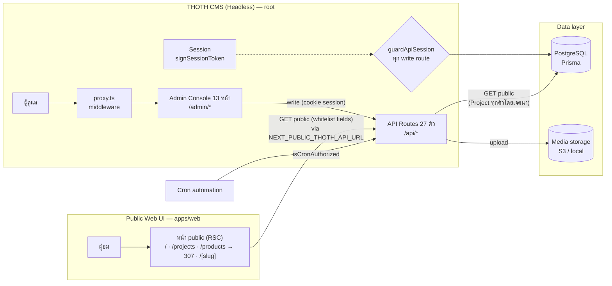

# THOTH — Micro Headless CMS

**Headless CMS + Admin Console + หน้าเว็บสาธารณะ สำหรับขายโมดูลและเทมเพลต**

`v1.0.0-beta.1` · Next.js 16 · TypeScript · Prisma · PostgreSQL

> **โมเดลธุรกิจ:** THOTH เป็น open source — รายได้มาจากการ**ขายโมดูลและหน้าเว็บ**
> ดังนั้น API อ่านข้อมูลสาธารณะ (เช่น Projects) เปิดกว้างโดยเจตนา — ดูหัวข้อ "นโยบายสำคัญ" ล่างสุด

---

## การแยกส่วน (Architecture)

โปรเจกต์นี้แยกเป็น **สองส่วนที่ deploy ได้อิสระจากกัน**:

| | **THOTH CMS (Headless)** | **Public Web UI** |
| --- | --- | --- |
| ที่อยู่ | repository root (`app/`, `lib/`, `prisma/`) | `apps/web/` (package: `thoth-web`) |
| หน้าที่ | Admin Console + REST API + Auth + Database | หน้าสาธารณะที่ผู้ชมเห็น |
| ใครใช้ | ผู้ดูแลระบบ | ผู้ชมทั่วไป |
| ต่อกัน | เสิร์ฟ API ที่ `/api/*` | ดึงข้อมูลผ่าน `NEXT_PUBLIC_THOTH_API_URL` |
| ห้าม | — | ห้าม import `lib/` ของ CMS (ต้องคุยผ่าน API เท่านั้น) |

**สิ่งที่แยกจากกันชัดเจน:**

- **CMS (root)** — ไม่ต้องรู้เรื่อง UI ของผู้ชมเลย: `Admin Console` 13 หน้า (`/admin/*`) · `API Routes` 27 ตัว (`/api/*`) · `proxy.ts` (middleware คุม `/admin`, `/login`, `/setup`) · `Prisma → PostgreSQL` · session แบบ signed (`SESSION_SECRET`)
- **Public Web (`apps/web`)** — หน้า server components เท่านั้น (`/`, `/projects`, `/products` → redirect, `/[slug]`) · ไม่มีโค้ด CMS · build เป็น standalone ของตัวเอง

---

## Flow Chart



**อ่าน flow แบบสั้น:**

1. **ผู้ชม** → `apps/web` (server component) → `GET /api/*` (อ่านอย่างเดียว, ผ่าน field whitelist) → CMS → PostgreSQL
2. **ผู้ดูแล** → `/admin` (ผ่าน `proxy.ts`) → Admin Console → write เข้า `/api/*` (ต้องผ่าน `guardApiSession` + session cookie ที่ลงนาม) → PostgreSQL
3. **Cron** → automation API → ต้องผ่าน `isCronAuthorized` (fail-closed)

---

## Quick Start

### 1. THOTH CMS (root)

```bash
npm ci
npx prisma generate        # postinstall ถูก npm 12 block → รันเอง
cp .env.example .env.local # แล้วเติม DATABASE_URL + SESSION_SECRET
npx prisma db push         # sync schema (ไม่มี migrations folder)
npm run dev                # http://localhost:3000
```

### 2. Public Web (`apps/web`)

```bash
cd apps/web
npm ci
cp .env.example .env.local # NEXT_PUBLIC_THOTH_API_URL=http://localhost:3000
npm run dev
```

> CMS ต้องรันอยู่ก่อน — `apps/web` ยิง API ของ CMS ตอน render

### Commands ที่ใช้บ่อย

```bash
# root (CMS)
npm run dev            # dev server
npm run build          # production build
npm run lint           # eslint (baseline: 30 errors / 22 warnings จากของเดิม)
npm test               # node --test tests/*.test.mjs (30 tests)
npx tsc --noEmit       # typecheck
npm run scaffold:module -- --id=<id> --name=<ชื่อ>   # สร้างโครง extension

# apps/web
npm run build          # production build (standalone)
npm start              # node .next/standalone/server.js
```

---

## โครงสร้างโฟลเดอร์

```
THOTH/
├── app/                  # CMS: หน้า admin + API routes + หน้า public เดิม
│   ├── admin/            # 13 หน้า Admin Console
│   ├── api/              # 27 route handlers
│   └── [slug]/           # หน้า public เดิม (รอ cutover — ดู docs/SPLIT_HEADLESS_PLAN)
├── apps/web/             # Public Web UI (แยก deploy — ดูส่วน Architecture)
├── lib/                  # auth, prisma, storage, automation, security
├── components/           # admin components
├── modules/staff-member/ # module เดียวที่ wired แล้ว
├── extensions/           # โครง extension (ยังไม่มี extension จริง)
├── prisma/schema.prisma  # ไม่มี migrations/ — ใช้ db push
├── tests/                # route-policy + session (node:test)
├── proxy.ts              # Next 16 middleware
└── docs/                 # MODULE_STANDARD, UPDATE_PLAN, SPLIT_HEADLESS_PLAN, ...
```

---

## นโยบายสำคัญ (มติ 2026-10-09)

1. **Projects = public by design** — ไม่มี flag draft/published โดยเจตนา, `GET /api/projects` อ่านทุกตัวได้เสมอ — **ห้ามเพิ่ม draft filtering เป็น "fix"**
2. **Field whitelist คงไว้เสมอ** — `PUBLIC_PROJECT_SELECT` คือขอบเขตการเปิดเผยข้อมูล แม้เนื้อหาจะ public
3. **Page ต่างจาก Project** — `Page` มี `isPublished` และ public API ต้องกรอง draft เสมอ
4. **ทุก write route ต้องผ่าน `guardApiSession`** — บังคับโดย `tests/route-policy.test.mjs`
5. **เปลี่ยนนโยบายต้องแก้คู่กัน**: `AGENTS.md` section 6 + `tests/route-policy.test.mjs`

รายละเอียดทั้งหมด: **[AGENTS.md](./AGENTS.md)**

---

## เอกสารอ้างอิง

| เรื่อง | ไฟล์ |
| --- | --- |
| สถานะจริง/ปัญหาที่รู้แล้ว | `AGENTS.md` |
| แผนงานอัปเดต | `docs/UPDATE_PLAN_2026-10.md` |
| แผนแยกส่วน CMS/web | `docs/SPLIT_HEADLESS_PLAN_2026-10.md` |
| มาตรฐานโมดูล/extension | `docs/MODULE_STANDARD.md` |
| ติดตั้ง / Deploy | `INSTALLATION_GUIDE.md`, `DEPLOYMENT.md`, `docs/SELF_HOSTING.md` |
| Environment | `ENV_SETUP.md`, `.env.example` |
| ประวัติเวอร์ชัน | `CHANGELOG.md`, `RELEASE_NOTES.md` |

---

## Deploy

- **Vercel** — `vercel.json` + root app (ตรวจสอบ key ที่ไม่ตรง schema ปัจจุบันก่อนใช้: `docs/UPDATE_PLAN_2026-10.md` ข้อ 14)
- **Docker / self-host** — `Dockerfile` + `docker-compose.yml` (`output: "standalone"`), คู่มือ `docs/SELF_HOSTING.md`
- **apps/web** — deploy แยกต่างหาก ตั้ง `NEXT_PUBLIC_THOTH_API_URL` ชี้ CMS ที่ใช้งาน

---

**License:** ดู [LICENSE](./LICENSE) · **สถานะ:** beta — ยังไม่พร้อมผลิต (ดู `AGENTS.md` section 7)
